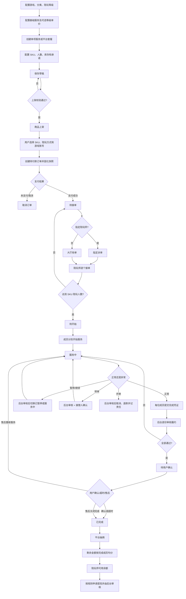

# 陪玩平台完整业务流程说明（基于当前实现）

> 更新日期：2026-08-16  
> 适用范围：`peiwan-platform` 当前代码与 V1～V51 数据库迁移  
> 文档原则：只描述已经实现的行为；尚未实现或仅实现一部分的能力会明确标注。

## 1. 文档目的

本文档描述平台从基础资料配置、陪玩师准入、商品创建与上架，到用户下单、支付、派单、多人接单、履约、暂停/继续、转单、炸单、完成审核、售后、平台抽佣、陪玩师入账与提现的完整链路。

当前核心业务是陪玩服务订单。钱包充值虽然也进入统一交易主表，但属于另一条业务分支，不适用陪玩履约流程。

## 2. 核心对象和职责

| 对象 | 作用 | 是否直接决定价格 |
|---|---|---|
| 游戏、区服、段位 | 商品、账号与陪玩师能力的基础配置 | 否 |
| 陪玩等级 | 新锐、进阶、大神等平台价格等级 | 与基础服务价格共同决定 |
| 基础服务 | 描述“提供什么服务”，可配置按小时、按局、按单的等级单价 | 单项服务时参与定价 |
| 商品 SPU | 用户看到的商品主体，分为单项服务和平台套餐 | 不直接保存成交档位 |
| SKU | 定义具体售卖档位、人数、数量、兜底价、库存和承诺 | 是 |
| SKU 承诺 | 保底、目标数量、有效条件、未达继续等规则 | 不参与价格计算 |
| 交易订单 | 保存金额、支付和退款状态 | 保存最终交易金额 |
| 服务订单 | 保存陪玩人数、指定人员/等级和履约主状态 | 保存成交基础单价 |
| 订单成员 | 一张多人订单中每位陪玩师的独立参与状态 | 结算时按完成成员分配 |
| 履约记录 | 每位成员的开始、完成凭证和后台审核记录 | 否 |
| 服务变更申请 | 转单、炸单、暂停、继续的独立审核单 | 可能产生退款或责任扣款 |
| 订单结算 | 平台佣金、陪玩师收入和平台流水 | 是 |

## 3. 全链路总览



## 4. 前置配置流程

### 4.1 游戏和商品分类

1. 后台创建并启用游戏。
2. 配置商品分类；商品必须选择末级分类。
3. 分类与商品必须属于同一个游戏。
4. 存在上架商品时，关联分类不能直接禁用。

### 4.2 陪玩等级和陪玩师能力

1. 每个陪玩等级归属于一个游戏，例如新锐、进阶、大神。
2. 陪玩师通过 `陪玩师资料 + 游戏资料` 关联游戏和价格等级。
3. 派单时只有满足以下条件的陪玩师才会进入候选列表：
   - 陪玩师已经启用且资料审核通过；
   - 对应游戏资料已经启用且审核通过；
   - 若订单指定等级，则陪玩师必须匹配该等级；
   - 未超过陪玩师个人与平台两层最大并发订单数；
   - 未参与过当前订单；
   - 派单规则不允许忙碌人员接单时，还必须处于可接单状态。

### 4.3 小程序申请入驻

1. 普通用户在“我的 → 申请成为陪玩师”填写姓名、电话、地址。
2. 系统只写入入驻申请记录，初始状态为“待联系”。
3. 后台在“陪玩师管理 → 入驻申请”查看，并可标记为：
   - 待联系；
   - 人工跟进中；
   - 已关闭。
4. 入驻申请不会自动创建陪玩师资料、不会授予陪玩师角色，也不会赋予接单权限。
5. 真正成为陪玩师仍需后台人工创建/绑定陪玩师资料、配置游戏能力并审核通过。

## 5. 基础服务配置

基础服务描述平台实际提供的服务内容，例如排位上分、娱乐陪玩、教学或护航。

### 5.1 基础服务用途

- 独立售卖：可以被单项服务商品引用，也可以作为套餐组成。
- 仅作套餐组成：只能放入平台套餐，不能创建单项服务商品。

### 5.2 基础服务等级价格

基础服务可以按不同计价单位配置陪玩等级单价：

- 按小时；
- 按局；
- 按单。

价格是可选的。基础服务没有配置价格时仍可作为服务说明使用，最终依赖 SKU 兜底价。基础服务存在上架商品引用时不能直接禁用。

## 6. 商品创建到上架

### 6.1 商品类型

#### 单项服务

- 必须且只能选择一个基础服务。
- 不能选择“仅作套餐组成”的基础服务。
- 按陪玩师等级价格计价。
- SKU 表示售卖档位，例如 1 小时、3 小时、1 局、5 局。
- 管理端可按基础服务已配置的计价单位自动生成标准 SKU，并预览各等级成交价。

#### 平台套餐

- 至少包含两个不重复的基础服务。
- 套餐组成只描述包含内容，不把各基础服务价格相加。
- 按 SKU 固定套餐总价计价。
- SKU 计价单位固定为“单”、单位数量固定为 1、价格类型固定为“整单总价”。
- 成交价以 SKU 套餐整单售价为准。

### 6.2 SKU 配置

SKU 当前支持：

- 规格编码、规格名称；
- 售价/兜底价、划线价；
- 计价单位、单位数量；
- 所需陪玩人数（1～20）；
- 每人单价或整单总价；
- 最少/最多购买数量；
- 无限库存或限量库存；
- 预计服务分钟数；
- 启用状态和排序；
- SKU 承诺规则。

### 6.3 SKU 承诺

已支持的承诺类型包括保底承诺、目标数量、成功条件、未达继续服务、指定物品、指定地图、补偿规则和其他规则。承诺不参与价格计算。

用户下单时，启用的 SKU 承诺会复制到 `pw_order_commitment` 形成订单快照。商品后续修改不会改变已经下单的承诺内容。

### 6.4 草稿、编辑、上架和下架

1. 新商品保存后状态为“草稿”。
2. 已上架商品不能直接编辑，必须先下架。
3. 商品可以从草稿上架，也可以从上架状态下架。
4. 当前没有独立的“商品审核中/审核通过”状态；具有权限的后台人员可在校验通过后直接上架。
5. 上架校验包括：
   - 所属游戏启用；
   - 所属分类启用；
   - 至少有一个基础服务且所有关联基础服务启用；
   - 至少有一个启用的 SKU。
6. 上架商品不能删除；需要先下架再删除。

## 7. 用户浏览、选择和计价

### 7.1 单项服务价格

用户选择了陪玩等级，或者指定了某位陪玩师时：

```text
单项服务成交单价
= 基础服务中对应陪玩等级、对应计价单位的单价
× SKU 单位数量
```

指定陪玩师时，以该陪玩师在当前游戏审核通过的价格等级为准，前端传入的其他等级不会覆盖陪玩师真实等级。

若没有选择等级，或基础服务缺少该等级/单位报价，则使用 SKU 兜底价。

### 7.2 套餐价格

```text
套餐成交单价 = SKU 固定整单售价
```

套餐基础服务价格不做累加。

### 7.3 订单总价

```text
每人单价：订单总价 = 成交单价 × 购买数量 × SKU 陪玩人数
整单总价：订单总价 = 成交单价 × 购买数量
```

平台套餐固定使用整单总价，因此套餐售价不会再乘陪玩人数。

## 8. 创建订单

### 8.1 下单校验

订单可以由小程序用户自助创建，也可以由后台人员代用户创建；两种入口最终都调用同一套订单创建和计价逻辑。下单时系统会检查：

- 用户存在且启用；
- 商品已经上架；
- SKU 启用；
- 购买数量符合最小/最大限制；
- 限量库存充足；
- 指定陪玩师时，其当前游戏资料已经审核；
- 陪玩等级、游戏账号、区服、当前段位和目标段位与商品所属游戏匹配；
- 联系人和 11 位手机号完整；
- 选择已保存的游戏账号，或完整填写游戏账号和游戏昵称。

### 8.2 下单写入的数据

系统会同时创建：

1. 通用交易主单，状态为“待付款”；
2. 陪玩服务订单，状态为“待付款”；
3. `pw_order_item`：商品和 SKU 成交快照；
4. `pw_order_game_profile`：本单游戏账号、区服和段位快照；
5. `pw_order_commitment`：SKU 承诺快照；
6. 订单状态日志。

限量 SKU 会在创建订单时扣减库存。

## 9. 支付和取消

### 9.1 当前支付方式

- 钱包支付：优先使用现金余额，不足部分使用赠送余额；余额不足时拒绝支付。
- 模拟微信支付：只用于开发测试，不调用真实微信支付，也不会产生真实外部扣款。
- 每次支付都有唯一的请求流水号，重复请求不会重复扣款。

支付成功后：

- 交易支付状态变为“已支付”；
- 服务订单从“待付款”进入“待接单”；
- 支付事务提交后触发自动派单。

### 9.2 取消分支

- 用户只能在“待付款”或“待接单”阶段取消。
- 后台状态操作还允许在“待开始”阶段取消。
- 未支付订单取消时没有支付记录可退。
- 已支付订单取消时执行全额退款：钱包现金和赠送金分别原路退回；模拟微信只更新内部退款状态。
- 取消后恢复限量 SKU 库存，并将订单成员设为取消。
- 进入“服务中”后不能走普通取消，必须走炸单审核。

## 10. 自动派单、指定派单和大厅抢单

### 10.1 支付后的自动发布条件

支付成功后，无论用户是否指定陪玩等级，只要订单没有指定具体陪玩师，系统都会创建大厅抢单任务。没有等级限制时，候选筛选不会加等级条件。

- 指定陪玩师：使用指定派单，仅通知指定人员。
- 未指定陪玩师：发布大厅抢单，通知符合条件的候选人员。

若支付成功但没有候选陪玩师，支付不会回滚，订单保持“待接单”，后台可在后续重新派单。

后台也可以绕过派单任务，直接把符合要求的陪玩师加入待接单订单；多人订单仍然只有达到 SKU 所需人数后才进入“待开始”。

### 10.2 候选排序

当前匹配分综合：

- 陪玩师评分；
- 是否为主游戏；
- 当前活跃订单数。

系统按匹配分从高到低通知，候选数量和抢单截止时间由派单规则控制。

### 10.3 多人接单

1. SKU 配置的陪玩人数会成为订单所需陪玩人数。
2. 每位接受派单的陪玩师都会生成独立 `pw_order_member`。
3. 未满员时，订单仍为“待接单”，任务显示为“部分接单”，后台可继续派单。
4. 达到所需人数后，订单立即进入“待开始”，剩余候选关闭。
5. 重复接单、超员接单和曾参与过该订单的陪玩师会被拒绝。

## 11. 开始服务和多人履约

### 11.1 开始规则

- 只有订单成员本人可以开始自己的服务。
- 每位成员都有“已接单未开始 → 已开始服务”的独立状态变化。
- 第一位成员开始时，订单主状态从“待开始”变成“服务中”。
- 其他成员不会因为第一位开始而自动变成“已开始服务”，仍需各自点击开始。

因此“订单已经服务中”和“某位成员已经开始”是两个不同层级的状态，不应只看订单主状态判断所有成员是否开始。

### 11.2 履约记录

成员开始后生成独立履约记录，状态为“服务中”。多人订单中，每位成员都有自己的履约记录、完成说明、完成数量、凭证和审核结果。

## 12. 暂停和继续

暂停/继续只适用于陪玩服务订单，不适用于钱包充值等其他交易类型。

### 12.1 暂停

1. 只有订单老板（下单用户）可以申请暂停。
2. 订单必须处于“服务中”。
3. 已有成员提交完成凭证时不能申请暂停。
4. 同一订单同时只能有一项待处理服务变更申请。
5. 后台审核通过后：
   - 订单从“服务中”变成“已暂停”；
   - 新增一段 `pw_service_pause_record`，记录暂停原因和开始时间。
6. 后台驳回时订单保持“服务中”。

### 12.2 继续

1. 只有订单老板可以申请继续。
2. 订单必须处于“已暂停”。
3. 后台审核通过后：
   - 订单从“已暂停”恢复为“服务中”；
   - 关闭当前未结束的暂停区间并记录恢复时间。

当前已保存每段暂停区间，但“有效服务时长 = 总时长 - 累计暂停时长”尚未接入订单计时、结算或自动售后逻辑。

## 13. 转单流程

### 13.1 发起条件

- 订单必须处于“服务中”。
- 老板或当前在役陪玩师可以发起。
- 陪玩师只能为自己申请转单。
- 必须选择当前在役成员作为转出成员。
- 必须选择接替陪玩师。
- 接替人不能是本人、不能历史参与过该订单，并且必须满足游戏等级和接单容量要求。
- 同一订单不能同时存在其他待处理服务变更申请。

### 13.2 审核和接替确认

```text
待后台审核
  ├─ 后台驳回 → 已驳回
  └─ 后台通过 → 等待接替人确认
       ├─ 接替人拒绝 → 接替人已拒绝
       └─ 接替人接受 → 转单完成
```

接替人接受后：

- 新建一个状态为“服务中”的订单成员和履约记录；
- 原成员标记为转出，不再作为在役完成成员；
- 保存转单成员链；
- 原成员无其他活跃订单时恢复为可接单；
- 接替成员进入忙碌状态；
- 订单主状态保持“服务中”。

### 13.3 转单责任金额

订单最终正常完成结算时，每次成功转出的成员按“订单成交基础单价 × 16%”承担转单责任，金额从其可用余额扣除并计入平台流水。余额不足时允许形成负余额。

转单后的标准订单收入只分给最终已经完成服务的成员；已经转出的成员不参与剩余服务款均分。

## 14. 炸单（终止服务）流程

### 14.1 发起和审核

- 订单必须处于“服务中”。
- 老板或当前陪玩师可以提交原因和最多 9 项凭证。
- 陪玩师只能针对自己的成员记录申请。
- 后台驳回：申请变为“已驳回”，订单继续服务。
- 后台通过：执行审核终止。

### 14.2 审核通过后的结果

1. 对最终在役的每位成员分别计算：

   ```text
   炸单责任金额 = 订单 baseUnitPrice × 20%
   ```

2. 责任金额从各陪玩师可用余额扣除，允许形成负余额，并计入平台罚责流水。
3. 已支付订单执行全额退款。
4. 订单和订单成员均进入“已取消”。
5. 没有其他活跃订单的陪玩师恢复为可接单。
6. 炸单订单不进行正常的平台抽佣和陪玩师收入分配。

## 15. 提交完成、平台审核和用户确认

### 15.1 成员提交完成

每位在役成员必须：

1. 已经开始自己的服务；
2. 填写完成说明；
3. 至少上传一项、最多上传九项完成凭证；
4. 可填写实际完成数量。

成员履约状态变为“待平台审核”。只有所有在役成员都已提交时，订单主状态才从“服务中”变成“待平台审核完成凭证”。

### 15.2 后台逐份审核

- 驳回某位成员：该履约记录变为“已驳回”，订单退回“服务中”，成员可以重新提交。
- 通过某位成员：该履约记录变为“已完成”。
- 所有在役成员均通过后：订单进入“待用户确认”，并设置用户确认截止时间。

默认确认期限为 24 小时，由订单规则配置。

### 15.3 用户确认或超时

- 用户主动确认：订单进入“已完成”。
- 开启自动完成规则时，后台任务每分钟扫描一次；超过确认截止时间仍未处理的订单自动进入“已完成”。
- 完成时所有在役订单成员标记为“已完成”，随后立即触发结算。

后台订单中心还保留“待开始 → 服务中”和“服务中 → 已完成”的人工状态修正能力。该入口会直接推进订单并在完成时触发结算，不经过成员提交凭证和履约审核，适合作为异常修正手段，不应作为日常正常履约路径。

## 16. 售后流程

### 16.1 发起条件

用户只能在以下阶段发起售后：

- 完成凭证待平台处理阶段；
- 等待用户确认阶段。

同一订单只能存在一个进行中的售后。用户需要填写问题说明，可上传凭证。发起后订单进入“售后处理中”。

### 16.2 后台处理结果

| 处理结果 | 订单去向 | 当前行为 |
|---|---|---|
| 驳回售后 | 待用户确认 | 售后驳回，继续等待用户确认 |
| 重新服务 | 服务中 | 陪玩师继续履约 |
| 协商关闭 | 已完成 | 按完成订单结算 |

当前售后模块尚未提供“全额退款/部分退款”独立处理结果；需要退款的服务中订单目前主要通过炸单审核终止完成全额退款。

## 17. 完成后的平台抽佣和陪玩师收入

订单只有满足以下条件才进行正常结算：

- 服务订单状态为“已完成”；
- 订单实付金额大于 0；
- 至少存在一位已经完成服务的订单成员；
- 同一订单尚未生成过结算单。

### 17.1 标准结算公式

```text
平台佣金 = 订单实付金额 × 当前启用的抽佣比例
陪玩师可分配池 = 订单实付金额 - 平台佣金
每位完成成员收入 = 可分配池 ÷ 完成成员人数
```

除最后一位成员承接小数余差外，完成成员平均分配。默认抽佣规则为 28%，后台可修改。

### 17.2 结算入账

结算会写入：

- 订单结算主表；
- 平台佣金结算明细；
- 每位完成成员的收入明细；
- 平台收入流水；
- 陪玩师收入记录；
- 陪玩师可用余额流水。

正常收入生成后立即进入陪玩师可用余额。若订单发生过成功转单，再追加转出成员 16% 责任扣款和平台责任收入流水。

### 17.3 示例

假设订单实付 300 元、平台抽佣 28%、最终完成成员 3 人：

```text
平台佣金 = 300 × 28% = 84 元
可分配池 = 300 - 84 = 216 元
每位完成成员收入 = 216 ÷ 3 = 72 元
```

如果其中一名早期成员曾成功转出，且订单基础单价为 100 元，则该转出成员另承担：

```text
100 × 16% = 16 元
```

该 16 元进入平台流水，不从最终完成成员的 216 元可分配池中扣除。

## 18. 陪玩师提现

1. 陪玩师从可用余额发起提现。
2. 当前默认只允许每周一申请。
3. 默认最低提现金额为 300 元，后台可修改。
4. 申请时金额从可用余额转入冻结余额，提现状态为“待审核”。
5. 后台审核通过：冻结余额扣除，状态变为“已打款”。
6. 后台驳回：冻结余额解除并退回可用余额，状态变为“已驳回”。

系统当前保存收款方式、收款人和收款账号，但没有接入真实银行、支付宝或微信自动打款接口，后台“通过”表示人工打款流程已经完成。

## 19. 主要状态速查

### 19.1 服务订单主状态

| 状态 | 含义 | 主要可执行动作 |
|---|---|---|
| 待付款 | 订单已经创建但尚未支付 | 支付、取消 |
| 待接单 | 已付款，等待陪玩师接单或多人满员 | 抢单、指定派单、取消、重新派单 |
| 待开始 | 所需人员已满，但尚未开始服务 | 成员开始、后台取消 |
| 服务中 | 至少一位成员已经开始履约 | 提交完成、暂停、转单、炸单 |
| 已暂停 | 后台已经通过暂停申请 | 老板申请继续 |
| 待平台审核 | 全员已提交完成凭证 | 履约审核、用户售后 |
| 待用户确认 | 平台审核通过 | 用户确认、售后、超时自动完成 |
| 售后处理中 | 用户已经发起售后 | 驳回、重新服务、关闭完成 |
| 已完成 | 订单完成并触发结算 | 查看结算和收入 |
| 已取消 | 普通取消或炸单终止 | 查看退款和责任流水 |

### 19.2 订单成员状态

| 状态 | 含义 |
|---|---|
| 已接单 | 已接单但尚未开始 |
| 服务中 | 该成员已经开始服务 |
| 已完成 | 该成员已完成并参与收入分配 |
| 已转出 | 已被接替，不参与最终正常收入均分 |
| 已取消 | 订单取消或炸单终止 |

### 19.3 派单任务状态

| 状态 | 含义 |
|---|---|
| 派单中 | 等待候选响应 |
| 部分接单 | 已有人接单但订单未满，当前候选已耗尽 |
| 已满员 | 所需成员已满 |
| 全部拒绝 | 所有候选拒绝 |
| 已超时 | 派单截止时间已到 |
| 已取消 | 后台取消派单 |

### 19.4 服务变更申请状态

| 状态 | 含义 |
|---|---|
| 待审核 | 等待后台处理 |
| 已驳回 | 后台驳回申请 |
| 已执行 | 暂停、继续或炸单已经审核执行 |
| 待接替人确认 | 转单后台已通过，等待接替人确认 |
| 接替人已拒绝 | 接替人拒绝转单邀请 |
| 转单完成 | 接替人接受且换人完成 |

## 20. 分支处理矩阵

| 场景 | 系统处理 | 金额处理 | 最终状态 |
|---|---|---|---|
| 未支付取消 | 直接取消 | 无退款 | 已取消 |
| 已支付但未接单取消 | 取消并恢复库存 | 全额退款 | 已取消 |
| 多人订单部分接单 | 保持待接单，可继续派单 | 资金保持已支付 | 待接单 |
| 指定人员不符合条件 | 自动派单失败，后台可重试 | 支付不回滚 | 待接单 |
| 暂停审核驳回 | 继续服务 | 无变化 | 服务中 |
| 暂停审核通过 | 建立暂停区间 | 无变化 | 已暂停 |
| 转单审核驳回 | 原成员继续服务 | 无变化 | 服务中 |
| 转单目标拒绝 | 原成员继续服务，可重新发起 | 无变化 | 服务中 |
| 转单成功 | 原成员转出、接替人继续 | 订单完成时转出人扣基础单价 16% | 服务中 |
| 炸单审核驳回 | 继续服务 | 无变化 | 服务中 |
| 炸单审核通过 | 服务终止 | 用户全额退款；每位在役成员扣基础单价 20% | 已取消 |
| 完成凭证驳回 | 退回继续服务 | 无变化 | 服务中 |
| 全部凭证通过 | 等待老板确认 | 资金暂不分配 | 待用户确认 |
| 老板确认/超时 | 完成订单 | 抽佣并给完成成员分账 | 已完成 |
| 售后重新服务 | 返回履约 | 暂不结算 | 服务中 |
| 售后协商关闭 | 直接完成 | 正常抽佣和分账 | 已完成 |

## 21. 当前实现边界和待完善项

以下内容当前尚未完整实现，不应按正式生产能力对外承诺：

1. **真实支付**：微信支付和钱包充值仍有模拟路径，未接真实微信支付下单、回调、退款回调与对账。
2. **商品审核流**：商品只有草稿、上架、下架，没有独立的提交审核和审核通过阶段。
3. **暂停计时**：暂停区间已记录，但尚未从有效履约时长、超时规则、结算和售后中扣除。
4. **承诺自动核销**：SKU 承诺已展示并生成订单快照，但尚未自动计算目标进度、自动判定未达标或自动执行补偿。
5. **售后退款**：售后模块尚无部分退款和独立退款结果；炸单审核通过目前执行全额退款。
6. **提现打款**：后台审核和账户冻结/解冻已实现，真实支付机构打款未接入。
7. **入驻转化**：入驻申请只转人工，不会自动创建或审核陪玩师，人工沟通后的资料录入仍在后台完成。
8. **有效天数与限购**：商品字段和基础校验已存在，但当前下单服务未实际校验用户历史购买次数或有效期消费逻辑。
9. **待付款超时**：当前没有自动关闭长期未支付订单的定时任务。
10. **售后与责任规则配置化**：转单 16%、炸单 20% 目前是代码常量，不是后台可配置规则。
11. **后台人工推进订单**：后台仍可直接开始或完成订单，会绕过标准的成员凭证审核链路，生产环境应进一步限制权限或增加强制原因与审计提示。

## 22. 关键数据落点

| 环节 | 主要数据表 |
|---|---|
| 入驻申请 | `pw_player_application` |
| 陪玩师及游戏能力 | `pw_player`、`pw_player_game`、`pw_player_level` |
| 基础服务价格 | `pw_service_item`、`pw_service_level_price` |
| 商品和 SKU | `pw_product`、`pw_product_service`、`pw_product_sku` |
| SKU/订单承诺 | `pw_sku_commitment`、`pw_order_commitment` |
| 交易和服务订单 | `pw_trade_order`、`pw_service_order`、`pw_order_item` |
| 游戏账号快照 | `pw_order_game_profile` |
| 支付 | `pw_trade_payment`、用户钱包与流水表 |
| 派单 | `pw_dispatch_task`、`pw_dispatch_candidate`、`pw_dispatch_action_log` |
| 多人订单 | `pw_order_member` |
| 履约 | `pw_fulfillment`、`pw_fulfillment_proof`、`pw_fulfillment_audit` |
| 暂停/继续 | `pw_service_exception_request`、`pw_service_pause_record` |
| 转单 | `pw_service_exception_request`、`pw_service_member_transfer` |
| 炸单/责任 | `pw_service_liability`、`pw_service_penalty_ledger` |
| 售后 | `pw_after_sale`、`pw_after_sale_proof`、`pw_after_sale_log` |
| 结算 | `pw_order_settlement`、`pw_order_settlement_detail` |
| 平台收入 | `pw_platform_ledger` |
| 陪玩师收入和提现 | `pw_player_earning`、`pw_player_account`、`pw_player_account_transaction`、`pw_withdrawal_request` |

---

本文档描述的是当前代码行为。后续若接入真实支付、有效服务时长、部分退款或承诺自动核销，应同步更新状态机、金额公式和分支矩阵，避免前后端出现多个业务口径。
